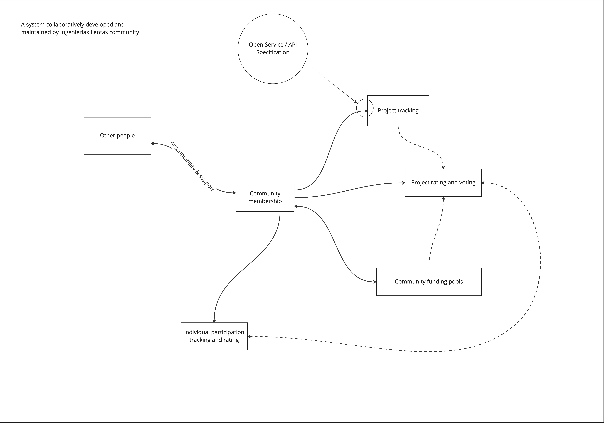

# sistema
System specification for community and project management and funding

## Design

### Subsystems

- [Comunidades](#comunidades) : [repo](https://github.com/ingenierias-lentas/comunidades)
- [Fondos](#fondos) : [repo](https://github.com/ingenierias-lentas/fondos)
- [Proyectos](#proyectos) : [repo](https://github.com/ingenierias-lentas/proyectos)
- [Votacion](#votacion) : [repo](https://github.com/ingenierias-lentas/votacion)

### Comunidades

[repo](https://github.com/ingenierias-lentas/comunidades)

*Community management sub-system*

### Fondos

[repo](https://github.com/ingenierias-lentas/fondos)

*Funding sub-system*

### Proyectos

[repo](https://github.com/ingenierias-lentas/proyectos)

*Project sub-system*

### Votacion

[repo](https://github.com/ingenierias-lentas/votacion)

*Voting sub-system*